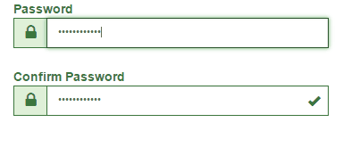

# angular-compare-validator


This is a small Angular directive that supports form input validation for equal values, e.g. for password and comparePassword fields.
It's automatically updated when either the source or destination value is changed.

## Usage

### Installation
Install via npm

    npm install angular-compare-validator --save

### Include the directive in your app.module.ts

``` TypeScript
import { CompareValidatorModule } from 'angular-compare-validator';

@NgModule({
    imports: [
        CompareValidatorModule
    ]
})
export class AppModule {
}
```

### Include it in your view
``` html
<input type="password" name="passwordInput" [(ngModel)]="password" />
<input type="password" name="confirmPasswordInput" [compareEqual]="password" [(ngModel)]="confirmPassword" />
<span *ngIf="confirmPasswordInput.errors && confirmPasswordInput.errors.compareEqual">
    Passwords do not match
</span>
```

## Demo

